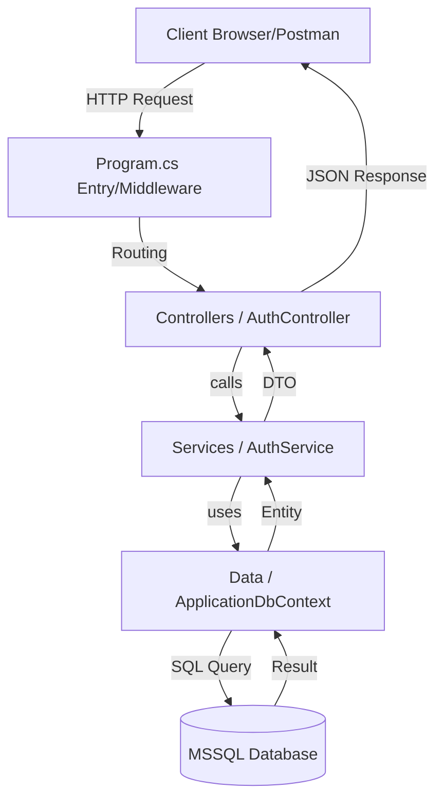

# Backend Flow & Architecture Documentation

This document provides an in-depth look at the internal workings of the `LoginBackend` application, tracing the flow of data from an HTTP request to the database and back.

## 1. High-Level Architecture

The backend follows a layered architecture pattern:

---

## 2. Component Breakdown

### A. Entry Point: `Program.cs`
The entry point of the application where services are configured and the HTTP request pipeline is defined.
- **Dependency Injection**: Registers `ApplicationDbContext` and services like `IAuthService`.
- **Middleware**:
    - `UseCors`: Handles cross-origin requests.
    - `UseAuthentication`: Validates JWT tokens.
    - `UseAuthorization`: Handles role-based access.
    - `MapControllers`: Routes requests to the appropriate controller.

### B. Controllers: `Controllers/`
Controllers handle incoming HTTP requests and map them to service methods.
- **`AuthController.cs`**:
    - `[HttpGet("health")]`: Database health check.
    - `[HttpPost("request-otp")]`: Initiates login flow.
    - `[HttpPost("verify-otp")]`: Validates OTP and creates session.
    - `[Authorize] [HttpGet("verify")]`: Validates persistent session.
    - `[Authorize] [HttpPost("create-user")]`: Admin functionality for user creation.

### C. Services: `Services/`
Services contain the core business logic.
- **`AuthService.cs`**:
    - Handles OTP generation and hashing (using BCrypt).
    - Manages session IDs and expiration.
    - Implements permission checks (e.g., Only admins can create users).
    - **DateTime Strategy**: Uses `DateTimeOffset.Now` to ensure local time (+05:30) is persisted.

### D. Data Access: `Data/`
- **`ApplicationDbContext.cs`**: 
    - Maps C# entities to SQL Server tables.
    - Configures column mappings (e.g., mapping `MobileNumber` property to `mobile_number` column).

### E. Models: `Models/`
- **`Entities/User.cs`**: The data model representing a user record in the `users` table.
- **`Request/`**: DTOs for incoming data (e.g., `SignUpRequest`, `VerifyOtpRequest`).
- **`Response/`**: DTOs for outgoing data (e.g., `LoginResponse`).

---

## 3. Core Request Flows

### 🟢 Authentication Flow (OTP Based)
1. **Request OTP**:
   - `Client` sends `mobile_number` to `POST /api/auth/request-otp`.
   - `AuthService` hashes a random 6-digit OTP and saves it to the `User` record with an 1-minute expiry.
2. **Verify OTP**:
   - `Client` sends `mobile_number` and `otp` to `POST /api/auth/verify-otp`.
   - `AuthService` verifies the hash and expiry.
   - If valid, a new `SessionId` is generated, saved to the DB, and a **JWT Token** is returned to the client.

### 🟢 Session Verification Flow
1. **Verify Session**:
   - `Client` sends JWT in `Authorization` header and `SessionId` in `X-Session-Id` header.
   - `AuthController` checks if the `SessionId` exists in the DB, hasn't expired, and the user is not deleted.
   - This ensures sessions survive server restarts.

---

## 4. Database Schema (`users` table)

| Column | Type | Description |
| :--- | :--- | :--- |
| `id` | `int` (PK) | Auto-incrementing identifier. |
| `name` | `varchar` | User's full name. |
| `mobile_number` | `varchar` | Unique identifier for login. |
| `email` | `varchar` | Optional email address. |
| `user_type` | `int` | 1 = Admin, 2 = Regular User. |
| `otp` | `varchar` | Hashed OTP for verification. |
| `otp_valid` | `datetimeoffset` | Expiration time for the OTP. |
| `session_id` | `varchar` | Current active persistent session ID. |
| `session_expires_at` | `datetimeoffset` | Expiration for the persistent session. |
| `created_at` | `datetimeoffset` | Local creation timestamp. |
| `updated_at` | `datetimeoffset` | Local last-update timestamp. |
| `deleted_at` | `datetimeoffset` | Soft-delete timestamp. |
| `is_active` | `bit` | Boolean flag for account status. |
